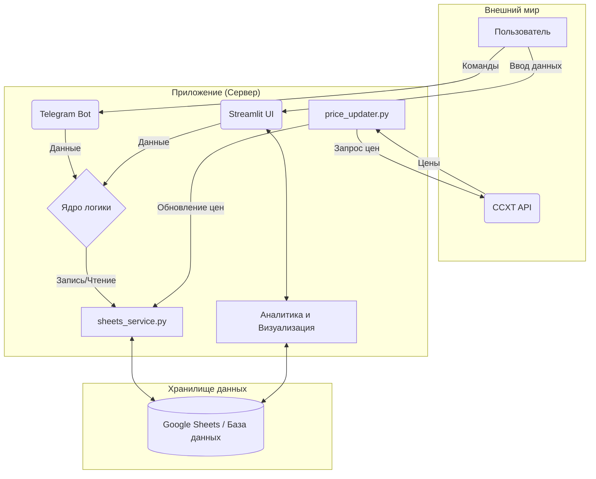

# Финансовый Дэшборд (Deal Tracker)

**Версия:** 1.1 (июнь 2025)

---

## 0. Mission Statement

Проект предназначен для частных инвесторов и трейдеров, которые ведут учёт сделок в криптовалютах. Цель — автоматизация учёта, сокращение ручных операций и повышение точности финансовой аналитики для принятия взвешенных решений.

---

## 1. Общая схема архитектуры



---

## 2. Основные возможности

- Логирование операций (BUY/SELL/DEPOSIT/WITHDRAWAL/TRANSFER) через Telegram-бот или веб-интерфейс.
- Автоматический расчет средней цены входа, нереализованного и реализованного PNL (FIFO).
- Интерактивный дашборд с фильтрацией.
- Поддержка русского и английского языков.
- Фоновое обновление цен через CCXT.

---

## 3. Стек технологий

- **Backend:** Python 3.11+
- **Веб-интерфейс:** Streamlit
- **База данных:** Google Sheets
- **Telegram-бот:** python-telegram-bot
- **Работа с данными:** Pandas
- **Биржевые API:** CCXT

---

## 4. Установка и настройка

### 4.1 Установка зависимостей

```bash
git clone [репозиторий]
cd [папка проекта]
python -m venv .venv
source .venv/bin/activate
pip install -r requirements.txt
```

### 4.2 Структура Google Sheets

Создайте Google Sheets с листами:

- **Core\_Trades:** Timestamp (ISO8601), Order\_ID, Exchange, Symbol, Type, Amount, Price (8 знаков), Commission, Commission\_Asset, Notes, Trade\_ID, Trade\_PNL, Fifo\_Consumed\_Qty, Fifo\_Sell\_Processed
- **Open\_Positions:** Symbol, Exchange, Net\_Amount, Avg\_Entry\_Price, Current\_Price, Unrealized\_PNL, Last\_Updated
- **Fund\_Movements:** Movement\_ID, Timestamp, Type, Asset, Amount, Source\_Name, Destination\_Name, Fee\_Amount, Fee\_Asset, Transaction\_ID\_Blockchain, Notes
- **Account\_Balances:** Account\_Name, Asset, Balance, Entity\_Type, Last\_Updated\_Timestamp
- **Fifo\_Log:** Symbol, Buy\_Trade\_ID, Sell\_Trade\_ID, Matched\_Qty, Buy\_Price, Sell\_Price, Fifo\_PNL, Timestamp\_Closed, Buy\_Timestamp, Exchange
- **Analytics:** Date\_Generated, Total\_Realized\_PNL, Total\_Unrealized\_PNL, Net\_Total\_PNL, Total\_Trades\_Closed, Winning\_Trades\_Closed, Losing\_Trades\_Closed, Win\_Rate\_Percent, Average\_Win\_Amount, Average\_Loss\_Amount, Profit\_Factor, Expectancy, Total\_Commissions\_Paid, Net\_Invested\_Funds, Portfolio\_Current\_Value, Total\_Equity
- **System\_Status:** Timestamp, Component, Status, Last\_Updated, Error\_Message

### 4.3 Конфигурация параметров проекта

`config.py`:

- KNOWN\_EXCHANGES = ["binance", "bybit"]
- KNOWN\_WALLETS = ["metamask", "ledger"]
- INVESTMENT\_ASSETS = ["USDT", "USDC", "FDUSD"]

### 4.4 Безопасность

- `credentials.json` хранить в `/etc/secrets/deal_tracker/`, права 600.
- `.env` добавить в `.gitignore`.
- TELEGRAM\_ADMIN\_IDS\_STR="123456789,987654321"
- SSH доступ только по ключам.
- Рекомендуется: `ufw`, `fail2ban`.

---

## 5. Логика расчетов

- **Средняя цена входа:** средневзвешенное.
- **Нереализованный PNL:** (Текущая цена - Средняя цена) \* Количество.
- **Реализованный PNL:** FIFO.
- **Частичные продажи:** FIFO корректно отрабатывает частичные продажи без пересчета средней цены.

---

## 6. DevOps и развертывание

### 6.1 Системные требования

- v1.1: VPS 1 CPU / 2GB RAM / Ubuntu 22.04
- v2.2+: VPS 2 CPU / 4GB RAM / PostgreSQL

### 6.2 Запуск системы

```bash
pm2 start "streamlit run dashboard.py --server.port 8501" --name "dashboard_ui"
pm2 start bot_runner.py --name "telegram_bot" --interpreter python3
pm2 start price_updater_ccxt.py --name "price_updater" --interpreter python3
```

### 6.3 Обновление приложения

```bash
pm2 stop all
git pull origin main
pip install -r requirements.txt
pm2 restart all
```

---

## 7. Команды Telegram

- `/buy BTC/USDT 0.1 65000 exch:bybit notes:'Докупка'`
- `/sell ADA/USDT 500 0.75 exch:binance fee:1.5 fee_asset:USDT`
- `/deposit 10000 USDT dest_name:binance`
- `/withdraw 500 USDT source_name:metamask`
- `/transfer 1000 USDT bybit binance`
- `/update_analytics`

---

## 8. Тестирование

- Проверить депозит → `Fund_Movements`, `Account_Balances`.
- Проверить покупку → `Core_Trades`, `Open_Positions`.
- Проверить продажу → `Core_Trades`, `Trade_PNL`, `Open_Positions`.
- Запуск `/update_analytics` → `Fifo_Log`, `Analytics`.

---

## 9. Логирование и мониторинг

- Логи: `logs/`
- Логирование: `LOG_LEVEL` в `config.py`
- Мониторинг: `pm2 logs telegram_bot`, `pm2 monit`

---

## 10. Возможные ошибки и их решение

- `googleapiclient.errors.HttpError: 403` → Проверьте права сервисного аккаунта.
- `ccxt.RateLimitExceeded` → Увеличьте паузы между запросами в `price_updater.py`.
- Telegram-бот не отвечает → Проверьте `TELEGRAM_TOKEN` и соединение.

---

## 11. Ограничения текущей версии (v1.1)

- Google Sheets: до \~10,000 строк.
- Работа только со спотом.
- BASE\_CURRENCY (например USDT), мультивалютность не реализована.
- Добавление новых счетов вручную через `config.py`.

---

## 12. Roadmap v2.0+

**Аналитика и UI:**

- Аллокация портфеля
- Историческая доходность
- Аналитика по стратегиям
- Telegram-уведомления

**Ядро:**

- Импорт истории с бирж через API
- Учёт стейкинга/лендинга
- "Водопад Капитала"
- Подготовка налоговых отчетов
- UI для редактирования данных

**Миграция:**

- PostgreSQL база данных
- Многопользовательская поддержка
- SaaS-ready архитектура (FastAPI + React UI + OAuth2)

---

## 13. Производительность

- `price_updater.py`: рекомендуется обновление цен не чаще чем раз в 5 минут.
- Кэширование цен в Redis для оптимизации API-запросов.
- Ротация логов при помощи `logrotate`.

---

## 14. Требования к разработчику

- Python 3.11+
- Pandas, Google API, CCXT
- Streamlit, Telegram Bot API
- Linux, SSH, PM2
- Основы финансовых расчетов
- Базовые навыки DevOps

---

## 15. Версии и поддержка

- Текущая версия: **v1.1 (июнь 2025)**
- Поддерживаемый Python: **3.11+**
- Минимальный сервер: **1 CPU / 2GB RAM**
- Ответственный разработчик: **Павел**
- Статус: **Стабильная версия, готовая к эксплуатации**

